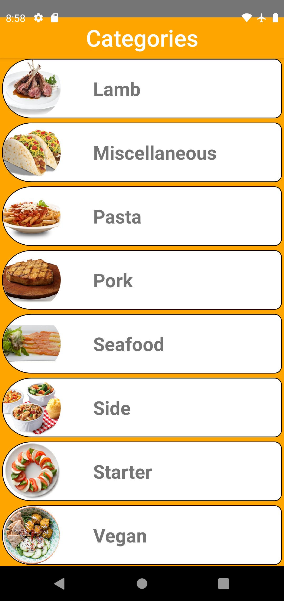
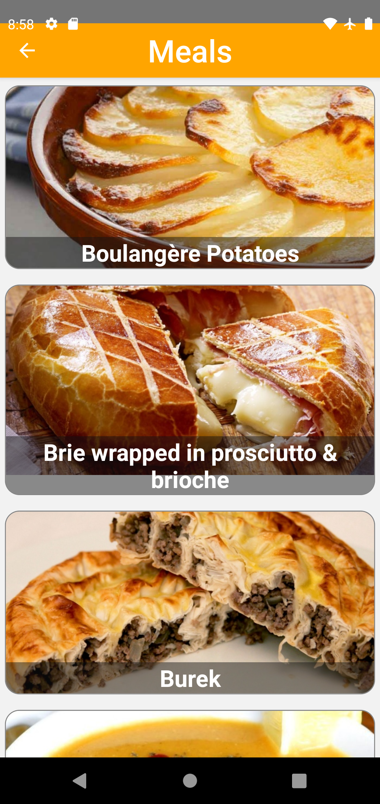
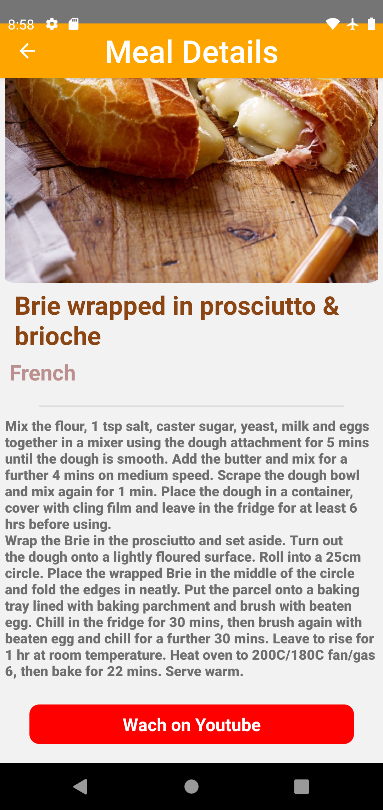

# TODO APP
## What this that?
This a recipe mobile app build by me via React Native. 
This project was builded [by me](https://github.com/ismail-sk/patikaLearning/tree/main/ReactNative/Homeworks/patikaTarifka) for my practicality exercise.

This a patika homework. [More about homework is here.](https://codepen.io/dmitrysharabin/pen/MWgQNYZ)
[Patika.dev React Native course(Turkish)](https://app.patika.dev/courses/react)

