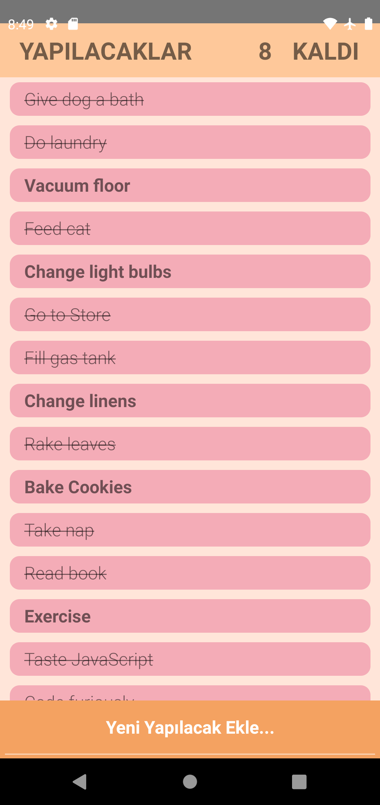
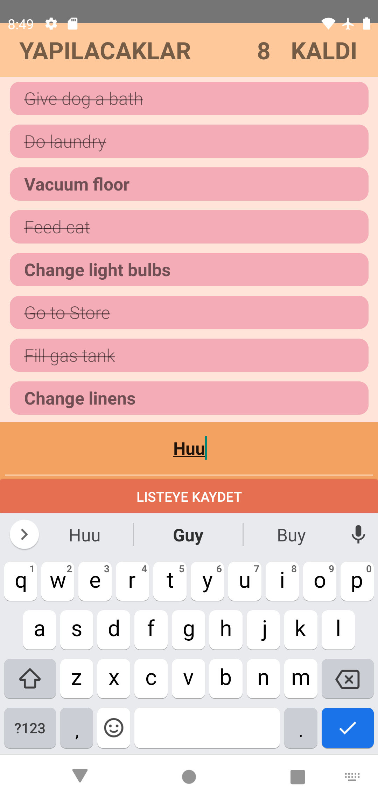

# Patika ToDo Mobile APP
## What this that?
This a basic todo mobile app build by me via React Native. 
This project was builded [by me](https://github.com/ismail-sk/patikaLearning/tree/main/ReactNative/Homeworks/patikaToDo) for my practicality exercise.

This a patika homework. [More about odev2 homework is here.](https://app.patika.dev/courses/react-native/odev_2)

[Patika.dev React Native course(Turkish)](https://app.patika.dev/courses/react-native)

